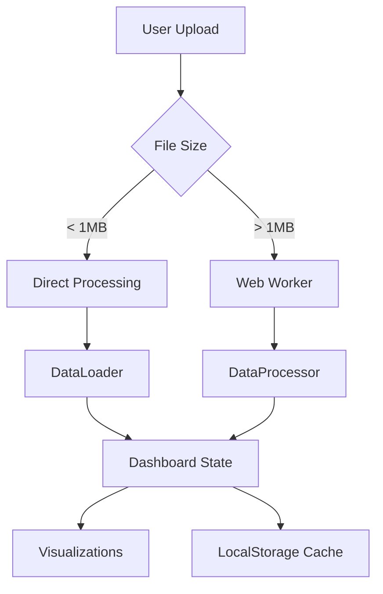

# Comprehensive Web Dashboard Documentation

## Table of Contents
1. [Project Overview](#project-overview)
2. [Current Status](#current-status)
3. [Architecture](#architecture)
4. [Implementation Progress](#implementation-progress)
5. [Development Roadmap](#development-roadmap)
6. [Technical Specifications](#technical-specifications)
7. [User Guide](#user-guide)
8. [API Documentation](#api-documentation)

---

## Project Overview

The N-Person Prisoner's Dilemma Web Dashboard is an interactive visualization and analysis platform for game theory simulations. It provides researchers and students with tools to analyze cooperation dynamics, strategy evolution, and network effects in multi-agent systems.

### Key Features
- **Real-time Visualization**: Interactive charts for cooperation evolution, strategy performance, and network dynamics
- **Data Management**: Import/export simulation results in CSV and JSON formats
- **Experiment Comparison**: Side-by-side analysis of multiple experiments
- **Advanced Analytics**: Statistical analysis, parameter sensitivity, and pattern detection
- **Responsive Design**: Works on desktop, tablet, and mobile devices

---

## Current Status

### ✅ Completed Features

#### Phase 1: Critical Data Loading ✓
- [x] Real scenario file loading from project directories
- [x] CSV parser supporting both summary and agent-level data
- [x] Web Worker implementation for large file handling (>1MB)
- [x] Progress indicators for file processing
- [x] Multiple file format support (JSON, CSV with various structures)

#### Phase 2: Visualization Enhancements ✓
- [x] Chart line toggling for readability
- [x] Zoom and pan controls using Chart.js plugins
- [x] Centralized strategy color system for consistency
- [x] Network visualization with D3.js
- [x] Performance optimization for large networks

#### Phase 3: UI/UX Improvements ✓
- [x] Loading states and progress bars
- [x] Comprehensive error handling with user-friendly messages
- [x] Mobile responsive design with touch support
- [x] Dark/light theme toggle
- [x] Experiment management (Clear All, Clear Examples, Search/Filter)

#### Phase 4: New Features ✓
- [x] Experiment tagging and automatic grouping
- [x] Advanced visualizations (heatmaps, 3D plots via Plotly)
- [x] Export functionality (individual and bulk)
- [x] LocalStorage caching with quota management

### 🚧 In Progress
- [ ] Real-time simulation execution
- [ ] Backend API integration
- [ ] User authentication and sessions
- [ ] Collaborative features

### 📋 Planned Features
- [ ] Machine learning insights
- [ ] Automated report generation
- [ ] Integration with Jupyter notebooks
- [ ] Public experiment sharing

---

## Architecture

### Current Architecture (Static Web App)

```
web-dashboard/
├── index.html              # Main entry point
├── css/
│   └── style.css          # Styling with CSS variables
├── js/
│   ├── init.js            # Initialization and dependency management
│   ├── dashboard.js       # Main controller
│   ├── data-loader.js     # File loading and parsing
│   ├── data-processor.js  # DOM-free data processing for Web Worker
│   ├── file-worker.js     # Web Worker for large files
│   ├── strategies.js      # Strategy definitions and colors
│   ├── visualizations.js  # Chart creation and management
│   ├── analysis-tools.js  # Statistical analysis
│   └── network-vis.js     # Network visualization with D3
└── assets/
    └── images/           # Icons and graphics
```

### Data Flow



### State Management

Currently using vanilla JavaScript with a centralized Dashboard class:

```javascript
class Dashboard {
  experiments = []        // All loaded experiments
  currentExperiment = null // Selected experiment
  charts = {}            // Chart.js instances
  settings = {}          // User preferences
}
```

---

## Implementation Progress

### Recent Fixes (January 2025)

1. **Lucide Icon Loading Issues**
   - Changed from CSS font to JavaScript library
   - Implemented robust initialization in `init.js`
   - Added `safeCreateIcons()` wrapper to prevent errors

2. **CSV Agent-Level Data Support**
   - Added `processAgentLevelData()` method
   - Automatically detects CSV format based on columns
   - Aggregates agent moves into round statistics

3. **Web Worker Improvements**
   - Created `data-processor.js` without DOM dependencies
   - Fixed "window is not defined" error
   - Improved file tracking and progress reporting

4. **Experiment Management UI**
   - Added bulk operations (Clear All, Clear Examples)
   - Implemented search/filter functionality
   - Added Export All feature

### File Modifications Log

| File | Changes | Status |
|------|---------|--------|
| `index.html` | Updated lucide loading, added init.js | ✓ |
| `js/init.js` | Created for dependency management | ✓ |
| `js/dashboard.js` | Added experiment management methods | ✓ |
| `js/data-processor.js` | Created for Web Worker use | ✓ |
| `js/data-loader.js` | Added agent-level CSV support | ✓ |
| `js/file-worker.js` | Updated to use DataProcessor | ✓ |

---

## Development Roadmap

### Short Term (Next 2 Weeks)

#### 1. Performance Optimizations
- [ ] Implement virtual scrolling for large experiment lists
- [ ] Add chart data decimation for >1000 points
- [ ] Optimize network rendering with WebGL
- [ ] Implement lazy loading for visualizations

#### 2. Enhanced Analytics
- [ ] Add statistical significance testing
- [ ] Implement correlation analysis
- [ ] Create parameter sensitivity visualizations
- [ ] Add time series decomposition

#### 3. Improved Data Management
- [ ] Add data validation schemas
- [ ] Implement data transformation pipeline
- [ ] Support for HDF5 and Parquet formats
- [ ] Add experiment versioning

### Medium Term (1-2 Months)

#### 1. Backend Integration
```python
# Planned FastAPI backend structure
app/
├── api/
│   ├── experiments.py    # CRUD operations
│   ├── simulations.py    # Run simulations
│   ├── analysis.py       # Advanced analytics
│   └── auth.py          # Authentication
├── models/
│   ├── experiment.py
│   ├── user.py
│   └── simulation.py
├── services/
│   ├── runner.py        # Simulation execution
│   ├── analyzer.py      # Data analysis
│   └── exporter.py      # Report generation
└── database/
    └── schema.sql
```

#### 2. Real-time Features
- [ ] WebSocket connection for live updates
- [ ] Collaborative cursors and annotations
- [ ] Real-time simulation monitoring
- [ ] Live parameter adjustment

#### 3. Advanced Visualizations
- [ ] Interactive 3D network layouts
- [ ] Animated strategy evolution
- [ ] Parameter space exploration tools
- [ ] Custom visualization builder

### Long Term (3-6 Months)

#### 1. Machine Learning Integration
- [ ] Pattern detection algorithms
- [ ] Strategy prediction models
- [ ] Anomaly detection
- [ ] Automated insights generation

#### 2. Collaboration Platform
- [ ] User accounts and profiles
- [ ] Experiment sharing and permissions
- [ ] Comments and discussions
- [ ] Version control for experiments

#### 3. Educational Features
- [ ] Interactive tutorials
- [ ] Guided experiment templates
- [ ] Quiz and assessment system
- [ ] Classroom management tools

---

## Technical Specifications

### Supported File Formats

#### 1. CSV Format (Summary Level)
```csv
round,cooperation_rate,avg_score,num_cooperators,num_defectors
0,0.5,2.5,15,15
1,0.6,2.8,18,12
```

#### 2. CSV Format (Agent Level)
```csv
scenario_name,round,agent_id,move,payoff,strategy
MyScenario,0,0,cooperate,0.5,tit_for_tat
MyScenario,0,1,defect,1.5,always_defect
```

#### 3. JSON Format
```json
{
  "id": "exp_123",
  "name": "Cooperation Study",
  "config": {
    "num_agents": 30,
    "num_rounds": 100,
    "network_type": "small_world",
    "agent_strategies": {
      "tit_for_tat": 15,
      "always_cooperate": 15
    }
  },
  "results": [
    {
      "round": 0,
      "cooperation_rate": 0.5,
      "avg_score": 2.5
    }
  ]
}
```

### Browser Compatibility
- Chrome 90+ ✓
- Firefox 88+ ✓
- Safari 14+ ✓
- Edge 90+ ✓
- Mobile browsers (iOS Safari, Chrome Android) ✓

### Performance Benchmarks
- Initial load: ~2s
- File processing: ~100MB/s
- Chart rendering: <100ms for 1000 points
- Network visualization: 60fps for <500 nodes

---

## User Guide

### Getting Started

1. **Loading Data**
   - Click "Upload" button or drag & drop files
   - Supports CSV and JSON formats
   - Multiple files can be selected

2. **Managing Experiments**
   - Use search bar to filter experiments
   - Click experiment cards to view details
   - Use bulk operations for cleanup

3. **Analyzing Results**
   - Navigate to Analysis tab
   - Select experiments to compare
   - Use interactive charts to explore data

### Keyboard Shortcuts
- `Ctrl/Cmd + O`: Open file dialog
- `Ctrl/Cmd + S`: Export current view
- `Ctrl/Cmd + /`: Toggle search
- `Esc`: Close modals

### Tips & Tricks
- Hold Shift to select multiple experiments
- Double-click charts to reset zoom
- Right-click for context menus
- Use Tab key for navigation

---

## API Documentation

### Planned REST API Endpoints

```typescript
// Experiments
GET    /api/experiments              // List all experiments
POST   /api/experiments              // Create new experiment
GET    /api/experiments/:id          // Get experiment details
PUT    /api/experiments/:id          // Update experiment
DELETE /api/experiments/:id          // Delete experiment

// Simulations
POST   /api/simulations/run          // Start new simulation
GET    /api/simulations/:id/status   // Check simulation status
GET    /api/simulations/:id/results  // Get simulation results
POST   /api/simulations/:id/stop     // Stop running simulation

// Analysis
POST   /api/analysis/compare         // Compare experiments
POST   /api/analysis/statistics      // Run statistical tests
POST   /api/analysis/sensitivity     // Parameter sensitivity
GET    /api/analysis/insights/:id    // Get ML insights

// Export
POST   /api/export/report            // Generate report
POST   /api/export/notebook          // Export as Jupyter notebook
GET    /api/export/formats           // List available formats
```

### WebSocket Events

```javascript
// Client -> Server
ws.send({ type: 'subscribe', experimentId: '123' })
ws.send({ type: 'run_simulation', config: {...} })
ws.send({ type: 'update_parameter', param: 'epsilon', value: 0.1 })

// Server -> Client
ws.onmessage = { type: 'simulation_update', data: {...} }
ws.onmessage = { type: 'experiment_modified', changes: {...} }
ws.onmessage = { type: 'error', message: '...' }
```

---

## Maintenance Notes

### Common Issues & Solutions

1. **LocalStorage Quota Exceeded**
   - Dashboard automatically removes old cached data
   - Users can manually clear cache in Settings

2. **Large File Processing**
   - Files >1MB automatically use Web Worker
   - Progress bar shows processing status
   - Can be cancelled by refreshing page

3. **Chart Performance**
   - Automatic data decimation for >1000 points
   - Line toggling to reduce rendered data
   - WebGL renderer for very large datasets

### Development Setup

```bash
# Clone repository
git clone https://github.com/yourusername/npd-dashboard

# Install dependencies (currently none - pure static site)
# For development server:
python -m http.server 8000
# or
npx serve web-dashboard

# Access at http://localhost:8000
```

### Testing

```bash
# Run tests (when implemented)
npm test

# E2E tests
npm run test:e2e

# Performance benchmarks
npm run benchmark
```

---

## Contributing

1. Fork the repository
2. Create feature branch (`git checkout -b feature/amazing-feature`)
3. Commit changes (`git commit -m 'Add amazing feature'`)
4. Push to branch (`git push origin feature/amazing-feature`)
5. Open Pull Request

### Code Style
- Use ES6+ features
- Follow ESLint configuration
- Add JSDoc comments for functions
- Write tests for new features

### Review Process
1. Automated tests must pass
2. Code review by maintainer
3. Update documentation
4. Merge to main branch

---

## License

This project is part of the N-Person Prisoner's Dilemma research framework.

---

Last Updated: January 2025